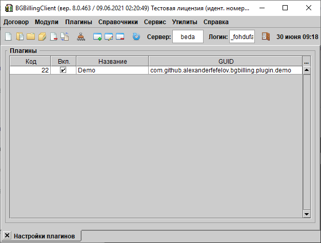
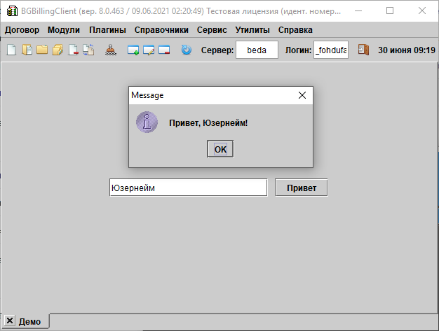

# bgbilling-plugin-demo

## Что это?

bgbilling-plugin-demo  — это демонстрационная плагина для использования совместно с сервером [BGBilling](https://bgbilling.ru/).






## Требования

* git
* JDK 8
* [gradle](https://gradle.org/)

## Как это установить?

Выполните команды:

```
git clone https://github.com/alexanderfefelov/bgbilling-plugin-demo
cd bgbilling-plugin-demo
gradle distZip
```

В результате в каталоге `module/build/distributions` будет создан zip-файл с дистрибутивом плагина, который можно установить в BGBilling штатными средствами.
